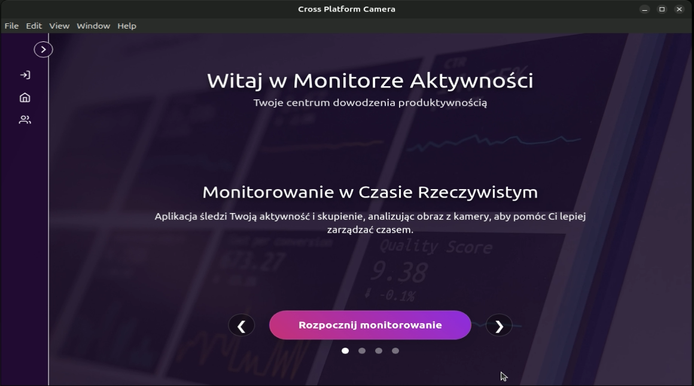

# Cross-Platform Camera User Monitor

A cross-platform desktop application designed to monitor users through a camera feed. It features a modern user interface built with SvelteKit and Electron, paired with a robust Python backend for real-time video processing and user authentication.



## 🌟 Features

- **User Authentication**: Secure login system for accessing the application.
- **Device Management**: Select and toggle between different camera devices.
- **Real-time Monitoring**: View the live camera feed directly within the app.
- **Computer Vision**: Real-time face and eye detection using OpenCV's Haar cascades.
- **Alert System**: In-app notifications and alerts based on camera monitoring data.
- **Cross-Platform Desktop App**: Packaged using Electron for seamless use on various operating systems.

## 🏗️ Architecture & Tech Stack

This project is divided into two main components: a Desktop Frontend and a RESTful Backend.

### Frontend

- **Framework**: [SvelteKit](https://kit.svelte.dev/)
- **UI Styling**: [Tailwind CSS](https://tailwindcss.com/)
- **Language**: TypeScript
- **Desktop Wrapper**: [Electron](https://www.electronjs.org/)
- **Build Tool**: Vite

### Backend

- **Framework**: [FastAPI](https://fastapi.tiangolo.com/) (Python)
- **Computer Vision**: OpenCV (Face/Eye Haar Cascades)
- **Database**: SQL (handled via SQLAlchemy/`models.py`)
- **Authentication**: JWT-based security (`utils/security.py`)

## 📂 Project Structure

```text
cross-platform-camera-user-monitor/
├── backend/                       # Python REST API & Computer Vision services
│   ├── app/                       # FastAPI application setup
│   ├── db/                        # Database configuration and models
│   ├── haarcascades/              # OpenCV pre-trained XML models for face/eye detection
│   ├── routers/                   # API routes (auth, video)
│   ├── services/                  # Business logic (video processor, auth service)
│   ├── utils/                     # Helper functions and security
│   ├── dependencies.py            # FastAPI dependency injections
│   ├── requirements.txt           # Python dependencies
│   └── run_server.py              # Backend entry point
│
└── frontend/                      # SvelteKit + Electron application
    ├── electron/                  # Electron main and preload scripts
    ├── src/
    │   ├── lib/                   # Shared UI components and utilities
    │   ├── routes/                # Application pages (login, mainpage, camera, users)
    │   └── styles/                # Global CSS and variables
    ├── static/                    # Static assets
    ├── package.json               # Node.js dependencies
    ├── svelte.config.js           # SvelteKit configuration
    ├── tailwind.config.js         # Tailwind styling configuration
    └── vite.config.ts             # Vite bundler configuration
```

## 🚀 Getting Started

### Prerequisites

- [Node.js](https://nodejs.org/) (v16 or higher recommended)
- [Python](https://www.python.org/) (v3.9 or higher recommended)

### 1. Setting up the Backend

1. Navigate to the backend directory:
    ```bash
    cd backend
    ```
2. (Optional but recommended) Create a virtual environment:
    ```bash
    python -m venv venv
    source venv/bin/activate  # On Windows use `venv\Scripts\activate`
    ```
3. Install dependencies:
    ```bash
    pip install -r requirements.txt
    ```
4. Run the API server:
    ```bash
    python run_server.py
    ```

### 2. Setting up the Frontend

1. Open a new terminal and navigate to the frontend directory:
    ```bash
    cd frontend
    ```
2. Install npm dependencies:
    ```bash
    npm install
    ```
3. Start the development server (runs SvelteKit locally):
    ```bash
    npm run dev
    ```
4. To run the app as a desktop application via Electron:
    ```bash
    npm run electron:dev  # Replace with actual script from your package.json
    ```

## 🖼️ Application Screens

Based on the UI designs, the app provides the following flow:

1. **Welcome Screen**: A carousel outlining the program's description and features.
2. **Login Screen**: Secure access requiring a Username and Password.
3. **Main Dashboard/Camera Screen**: The core interface allowing the user to select their video device, view the live camera feed, toggle the camera on/off, and review system alerts.
